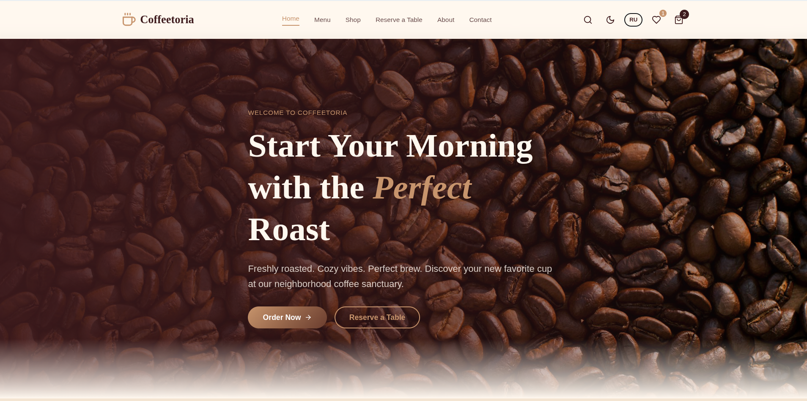

<div align="center">

# ☕ Coffeetoria

**Свежеобжаренный кофе. Уютная атмосфера. Идеальный вкус.**

[](https://reactjs.org/)
[](https://www.typescriptlang.org/)
[](https://vitejs.dev/)
[](https://tailwindcss.com/)



</div>

---

## О проекте

**Coffeetoria** — современный интернет-магазин кофейни с каталогом меню, онлайн-магазином, системой бронирования столов и личным кабинетом. Проект создан с любовью к кофе и вниманием к каждой детали.

## Возможности

- **Меню** — каталог кофейных напитков и еды с фильтрацией по категориям и поиском
- **Интернет-магазин** — покупка зёрен, мерча и напитков с корзиной и оформлением заказа
- **Бронирование столов** — онлайн-запись с выбором даты, времени и количества гостей
- **Тёмная тема** — переключение между светлым и тёмным режимами
- **Двуязычность** — полный перевод на русский и английский язык (EN/RU)
- **Избранное** — добавление товаров в список желаний
- **Админ-панель** — управление товарами, статистика продаж

## Технологии

| Технология | Назначение |
|------------|-----------|
| React 18 | UI-компоненты |
| TypeScript | Типизация |
| Vite | Сборщик |
| Tailwind CSS 4 | Стилизация |
| React Router | Навигация |
| Lucide React | Иконки |
| Recharts | Графики (админка) |

## Быстрый старт

```bash
# Клонировать репозиторий
git clone <url>
cd Coffee-main

# Установить зависимости
npm install

# Запустить dev-сервер
npm run dev

# Собрать для продакшена
npm run build

# Проверить типы
npm run typecheck
```

## Структура проекта

```
src/
├── components/       # Переиспользуемые компоненты
│   └── Layout.tsx    # Навигация, футер, layout
├── context/
│   └── AppContext.tsx # Глобальное состояние (корзина, язык, тема)
├── pages/
│   ├── Home.tsx       # Главная страница
│   ├── Menu.tsx       # Меню кофейни
│   ├── Shop.tsx       # Интернет-магазин
│   ├── Cart.tsx       # Корзина
│   ├── ProductDetail.tsx # Страница товара
│   ├── Reservation.tsx   # Бронирование
│   ├── About.tsx      # О нас
│   ├── Contact.tsx    # Контакты
│   ├── Account.tsx    # Личный кабинет
│   ├── Admin.tsx      # Админ-панель
│   └── StaticPages.tsx # Политика конфиденциальности, возвраты
├── utils/
│   ├── translations.ts # Система переводов EN/RU
│   └── currency.ts    # Форматирование валюты
└── main.tsx           # Точка входа
```

## Автор

**Coffeetoria** — Osh, Kyrgyzstan ☕

---

<div align="center">

Сделано с ❤️ и кофе

</div>
